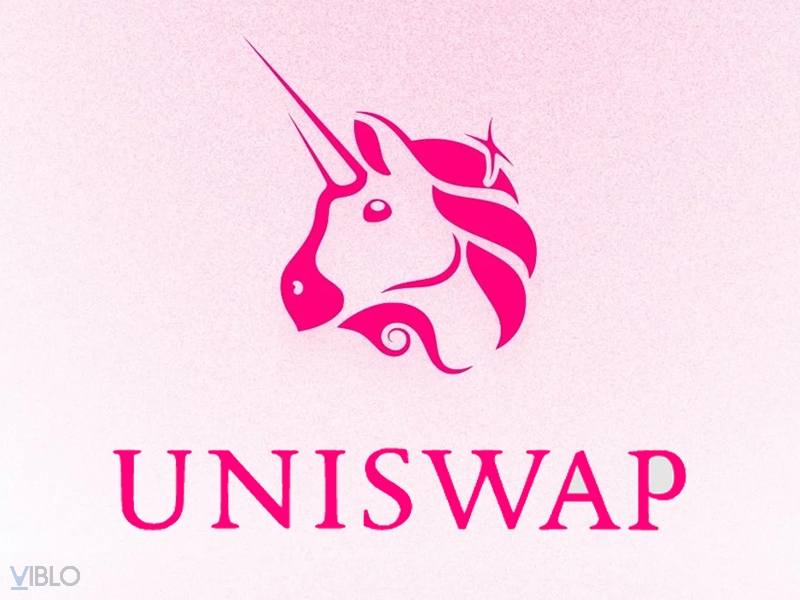
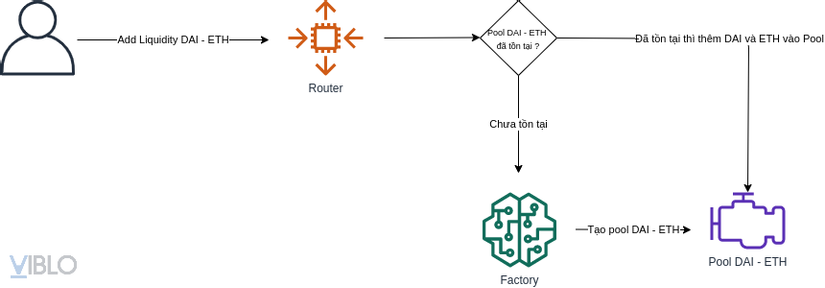
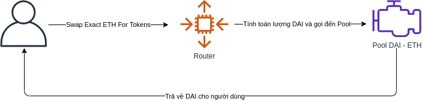
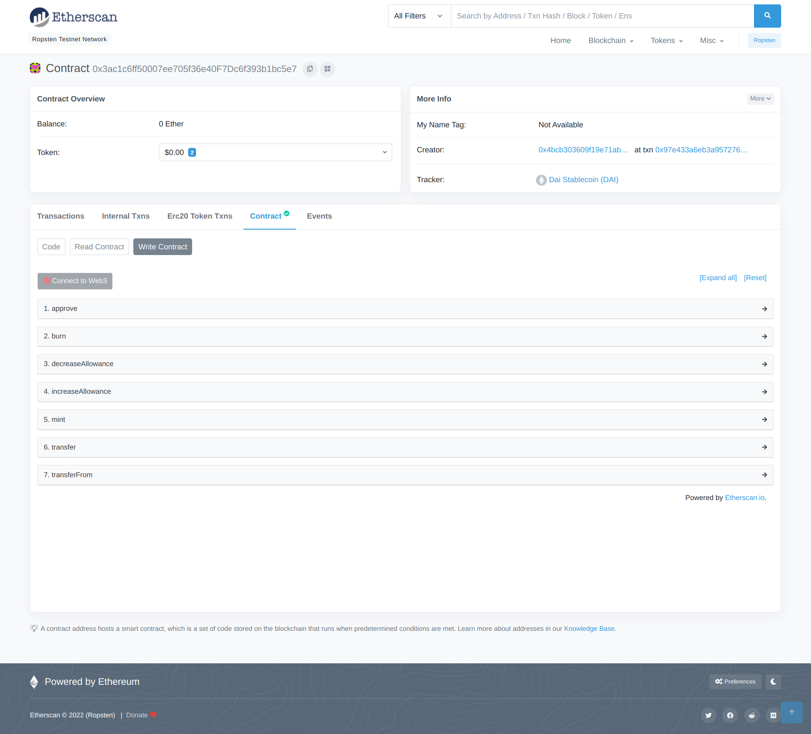
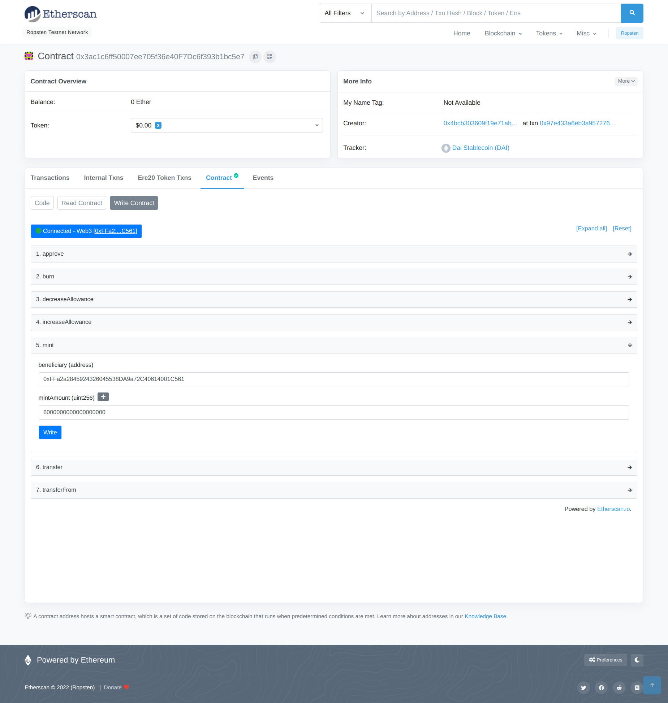
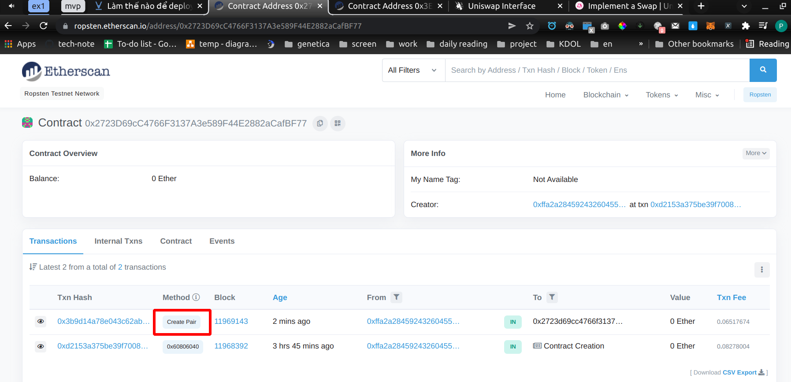
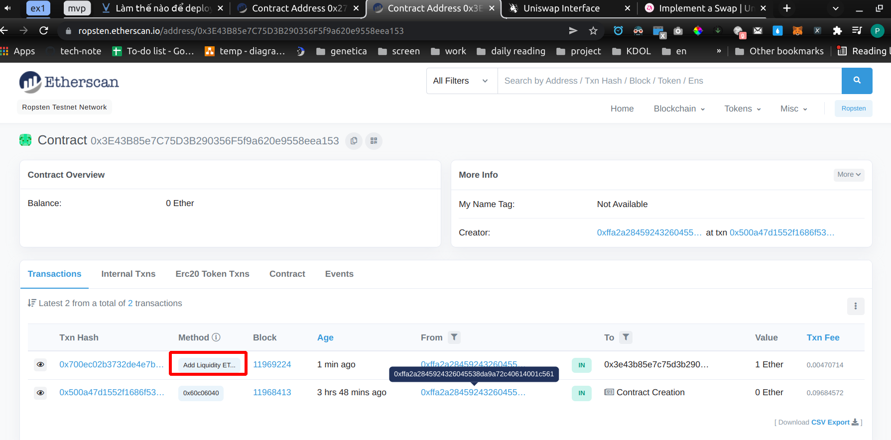

uniswap-v2 tutorial
---

- [1. Mở đầu](#1-mở-đầu)
- [2. Ba thành phần chính của Uniswap smart contract](#2-ba-thành-phần-chính-của-uniswap-smart-contract)
- [3. Nếu tự deploy thì sẽ bắt đầu từ đâu?](#3-nếu-tự-deploy-thì-sẽ-bắt-đầu-từ-đâu)
  - [3.1. Bước 1: chuẩn bị môi trường](#31-bước-1-chuẩn-bị-môi-trường)
  - [3.2. Bước 2. Deploy Factory](#32-bước-2-deploy-factory)
  - [3.3. Bước 3. Deploy Router](#33-bước-3-deploy-router)
  - [3.4. Bước 4. Update DAI address](#34-bước-4-update-dai-address)
  - [3.5. Bước 5. Tạo pool DAI - ETH (tạo pair DAI - ETH)](#35-bước-5-tạo-pool-dai---eth-tạo-pair-dai---eth)
  - [3.6. Bước 4. addLiquidityETH](#36-bước-4-addliquidityeth)
  - [3.7. Bước 6. Swap ETH lấy DAI](#37-bước-6-swap-eth-lấy-dai)
  - [Tổng hợp các bước](#tổng-hợp-các-bước)
- [4. Sử dụng Uniswap như một Oracle giá token. Say Bye Chainlink!](#4-sử-dụng-uniswap-như-một-oracle-giá-token-say-bye-chainlink)
  - [4.1. Bước 1. Lấy địa chỉ của Pair](#41-bước-1-lấy-địa-chỉ-của-pair)
  - [4.2. Bước 2. Lấy Reserves của Pair sau đó tính toán](#42-bước-2-lấy-reserves-của-pair-sau-đó-tính-toán)
  - [4.3. Thực hành](#43-thực-hành)
- [5. Kết luận](#5-kết-luận)
- [6. reference](#6-reference)

Làm thế nào để deploy smart contract của Uniswap!

# 1. Mở đầu



Nhắc đến Blockchain đặc biệt là Ethereum thì không thể không nhắc đến một start-up đình đám hóa Kỳ Lân chỉ trong thời gian ngắn đó là Uniswap, đúng như tên gọi của nó hiện tại Uniswap đang lock khoảng một lượng Token hơn 3 tỷ USD, giá trị vốn hóa thị trường hơn 660 triệu USD, thật là một con số khủng khiếp !

Bài viết này mình hướng đến người đọc đã có kiến thức cơ bản về Ethereum và các xu hướng Defi, có tìm hiểu về Uni và cách sử dụng nó, cho nên mình sẽ đi luôn vào các bước deploy smart contract của Uniswap và sử dụng nó sau khi deploy, còn bản chất bên trong gọi những hàm nào thì bạn có thể xem source code mình đã chuẩn bị, vì mình ko thể phân tích tưng hàm trong bài viết này được và mình sẽ không nói về các chỉ số, công thức mang tính chất tài chính trong bài viết này.

# 2. Ba thành phần chính của Uniswap smart contract

Chức năng của Uniswap nhìn thì có vẻ đơn giản, chỉ là đổi một lượng token này để lấy một lượng token khác, chẳng hạn như đổi ETH lấy DAI, nhưng đằng sau nó là một bộ smart contracts rất phức tạp được lắp tỉ mỉ với nhau.




Smart contract của Uniswap gồm 3 thành phần:

- Router: Nơi tiếp nhận yêu cầu từ user
- Factory: có nhiệm vụ tạo Pool
- Pool: mỗi cặp Token sẽ là một Pool riêng

Khi người dùng gọi function AddLiquidityETH() (với đầu vào là một lượng DAI và một lượng ETH) của contract Router, Router sẽ kiểm tra xem pool Dai - ETH đã tồn tại hay chưa, nếu chưa thì nó sẽ gọi đến Factory để Factory tạo ra Pool DAI - ETH, còn nếu đã tồn tại thì nó sẽ thêm một lượng DAI và ETH tương ứng vào Pool.



Khi người dùng muốn đổi một lượng ETH để lấy DAI, họ sẽ gọi đến contract Router, Router sẽ tính toán địa chỉ của Pool và lượng DAi tương ứng sau đó gọi đến Pool để Pool trả về DAI cho người dùng.

Như vậy, smart contract của Uniswap sẽ có 3 thành phần chính là Router, Factory, Pool, tuy nhiên khi deploy thì chúng ta chỉ cần deploy Factory trước sau đó đến Router, còn Pool sẽ được tạo ra trong quá trình vận hành.

# 3. Nếu tự deploy thì sẽ bắt đầu từ đâu?

## 3.1. Bước 1: chuẩn bị môi trường

```shell
ubuntu 20.04

# change version of node using nvm
➜  nvm use v12.22.10
Now using node v12.22.10 (npm v6.14.16)
# check version of node and npm
➜  node -v          
v12.22.10
➜  npm -v             
6.14.16
```

Để deploy smart contract của Uni thì ta phải có đủ smart contract của Uniswap gồm [Factory](https://github.com/Uniswap/v2-core) và [Router](https://github.com/Uniswap/uniswap-v2-periphery), tuy nhiên mình đã chuẩn bị sẵn một repo tổng hợp 2 contract và các scripts để các bạn có thể thực hành dễ dàng [tại đây](https://github.com/PhungXuanAnh/uniswap-v2-tutorial). Trong repo gồm 3 thư mục:

- factory: smart contract của Factory
- periphery: bản đầy đủ cảu Router
- periphery_short: bản rút gọn của Router, vì lý do gas của Ropsten nên bản này mình sẽ **lược bỏ chức năng remove Liquidity để có thể deploy lên Ropsten dễ dàng**

clone repo:

```shell
➜  git clone git@github.com:PhungXuanAnh/uniswap-v2-tutorial.git
```

tao env file:

```shell
cd factory
cp .env.example .env

cd periphery_short
cp .env.example .env
```

chỉnh sửa nội dung của file .env trong 2 thư mục trên:

```shell
INFURA_PROJECT_ID=''
OPERATOR_PRIVATE_KEY='' # ví dụ private key của account trên metamask
OPERATOR_ADDRESS='' # ví dụ địa chỉ của account trên metamask
ETH_GAS_LIMIT='' # ví dụ 1
```

## 3.2. Bước 2. Deploy Factory

Mở terminal và chạy lệnh sau:

```
cd factory
yarn install
yarn migrate --network ropsten
```

Kết quả trả về tương tự như sau thì bạn đã deploy thành công Factory:

```shell
   Replacing 'UniswapV2Factory'
   ----------------------------
   > transaction hash:    0xd2153a375be39f7008a14b8228d8a03e303b0c58f66de3f8942e58366219a654
   > Blocks: 1            Seconds: 9
   > contract address:    0x2723D69cC4766F3137A3e589F44E2882aCafBF77
   > block number:        11968392
   > block timestamp:     1644899523
   > account:             0xFFa2a2845924326045538DA9a72C40614001C561
   > balance:             4.844971390530692262
   > gas used:            4139002 (0x3f27fa)
   > gas price:           20 gwei
   > value sent:          0 ETH
   > total cost:          0.08278004 ETH

   > Saving artifacts
   -------------------------------------
   > Total cost:          0.08278004 ETH
```

## 3.3. Bước 3. Deploy Router

Thay address của Factory vừa được deploy vào file `periphery_short/migrations/1_deploy.js`, như ở trên là giá trị `0x2723D69cC4766F3137A3e589F44E2882aCafBF77`, sau đó vẫn ở terminal vừa rồi chạy lệnh sau để lấy BytecodeHash của UniswapV2Pair:

```shell
➜  factory git:(master) ✗ yarn getBytecodeHash

yarn run v1.22.17
$ node scripts/getBytecodeHash.js
ad84ccf48c0b64e4bbd468cf933a5378267e1560140186646a2550b0e01ee4bc
Done in 0.41s.
```

copy giá trị `ad84ccf48c0b64e4bbd468cf933a5378267e1560140186646a2550b0e01ee4bc` thay vào dòng thứ 37 của file `periphery_short/contracts/libraries/UniswapV2Library.sol`, sau đó mở terminal lên và chạy lệnh sau để deploy Router lên Ropsten:

```shell
cd periphery_short
yarn install
yarn migrate --network ropsten
```

kết quả trả về dạng:

```shell
   Replacing 'UniswapV2Router02'
   -----------------------------
   > transaction hash:    0x500a47d1552f1686f534e580501e6a0b2fd46c1aac89357307ddcc48abca1d9d
   > Blocks: 2            Seconds: 57
   > contract address:    0x3E43B85e7C75D3B290356F5f9a620e9558eea153
   > block number:        11968413
   > block timestamp:     1644900028
   > account:             0xFFa2a2845924326045538DA9a72C40614001C561
   > balance:             4.748125670530692262
   > gas used:            4842286 (0x49e32e)
   > gas price:           20 gwei
   > value sent:          0 ETH
   > total cost:          0.09684572 ETH

   > Saving artifacts
   -------------------------------------
   > Total cost:          0.09684572 ETH
```

## 3.4. Bước 4. Update DAI address

Địa chỉ mặc định của DAI trên ropsten là `0xad6d458402f60fd3bd25163575031acdce07538d`, tuy nhiên để có thể tự mint cho mình lượng DAI tùy ý, mình sử dụng DAI từ địa chỉ này `0x3ac1c6ff50007ee705f36e40F7Dc6f393b1bc5e7`, giá trị này được set trong constant DAI_ADDRESS trong các file `periphery_short/constant.js` và `factory/constant.js`

để thêm DAI vào địa chỉ ví, truy cập https://ropsten.etherscan.io/address/0x3ac1c6ff50007ee705f36e40F7Dc6f393b1bc5e7#writeContract, click **Connect to Web3** để kết nối đến account trên metamask



điền account address nhận DAI và số lướng DAI muốn nhận (ví dụ: 500000000000000000000 = 500 * 10^18 = 500 DAI)



## 3.5. Bước 5. Tạo pool DAI - ETH (tạo pair DAI - ETH)

**Chúng ta có thể hoàn toàn bỏ qua bước này mà đi xuống bước 4 luôn**, vì sao thì mời bạn xem lại Hình 2 trong Phần 2, khi ta gọi addLiquidityETH(), nếu Pool chưa tồn tại thì nó sẽ được tạo, tuy nhiên mình muốn trình bày luôn về bước này để mọi người hiểu hơn, mở terminal lên và chạy lệnh sau để tạo Pool DAI - ETH

chú ý trong Uniswap, họ sẽ dùng WETH thay cho ETH, nên địa chỉ trong ETH trong project này chính là địa chỉ của WETH


```shell
cd factory
yarn createPair --network ropsten dai eth
```

output

```shell
yarn run v1.22.17
$ npx truffle exec scripts/createPair.js --network ropsten dai eth
Using network 'ropsten'.

{
  tx: '0x3b9d14a78e043c62ab1c8726ecfeffe399d9e576eaa177e3432f5e5a1eb869ce',
  receipt: {
    blockHash: '0x83f226cc838809a27cccdb8b8050eb91c6badbefd4d4bd689342aaecd4b40994',
    blockNumber: 11969143,
    contractAddress: null,
    cumulativeGasUsed: 3258837,
    effectiveGasPrice: '0x4a817c800',
    from: '0xffa2a2845924326045538da9a72c40614001c561',
    gasUsed: 3258837,
    logs: [ [Object] ],
    logsBloom: '0x00000000000000000000000000000000000000000000000000000000000000000000000000000000000000000000000000000000000000000000000008000000000000000000000000000000400000000000800000000001000002000400000000000000000000000001000000000000000000000000000000000000000000000000000000000000000000000000000000000000000000000001000000000000000000000800000000000000000000000000000000000000000004000000000000000000000000000000000000000040000000000000000000000000000000000000000000000000080000000000000000000000000000000000000000000000',
    status: true,
    to: '0x2723d69cc4766f3137a3e589f44e2882acafbf77',
    transactionHash: '0x3b9d14a78e043c62ab1c8726ecfeffe399d9e576eaa177e3432f5e5a1eb869ce',
    transactionIndex: 0,
    type: '0x0',
    rawLogs: [ [Object] ]
  },
  logs: [
    {
      address: '0x2723D69cC4766F3137A3e589F44E2882aCafBF77',
      blockHash: '0x83f226cc838809a27cccdb8b8050eb91c6badbefd4d4bd689342aaecd4b40994',
      blockNumber: 11969143,
      logIndex: 0,
      removed: false,
      transactionHash: '0x3b9d14a78e043c62ab1c8726ecfeffe399d9e576eaa177e3432f5e5a1eb869ce',
      transactionIndex: 0,
      id: 'log_14d55986',
      event: 'PairCreated',
      args: [Result]
    }
  ]
}
Done in 23.94s.
```

Giao dịch thành công, ta có thể kiểm tra 1 transaction có name là `Create Pair` đã được tạo thành công trên trang contract của **Factory** như bên dưới :



Một Pool (Pair) DAI - ETH vừa được deploy và được Factory lưu lại địa chỉ đó, chạy lệnh sau xem địa chỉ của Pair:

```shell
➜  factory git:(master) ✗ yarn getPair --network ropsten dai eth

yarn run v1.22.17
$ npx truffle exec scripts/getPair.js --network ropsten dai eth
Using network 'ropsten'.

0x0E080ef16E7214Ca037558341dAfdc9914F335B6
Done in 7.76s.

```

mở terminal trong periphery_short, chạy lệnh sau để lấy điạ chỉ của Pair DAI - ETH thông qua Router:

```shell
➜  periphery_short git:(master) ✗ yarn getPairFor --network ropsten dai eth

yarn run v1.22.17
$ npx truffle exec scripts/getPairFor.js --network ropsten dai eth
Using network 'ropsten'.

0x0E080ef16E7214Ca037558341dAfdc9914F335B6
Done in 9.01s.

```

Có thể kết quả khi bạn thực hành sẽ khác với của mình nhưng bắt buộc kết quả của `getPair` bằng **Factory** và `getPairFor` bằng **Router** phải bằng nhau, tại sao lại như vậy? Rõ ràng là **Router** không hề lưu một địa chỉ nào ngoài địa chỉ **Factory** cả!

Đáp án là Uniswap đã vận dụng linh hoạt phương thức `create2`, bạn có thể xem thêm về `create2` [tại đây](https://viblo.asia/p/chuan-bi-cho-minh-mot-dia-chi-contract-dep-di-biet-dau-lai-thanh-ky-lan-gGJ59QO15X2).

Ở **Factory** họ dùng `create2` để deploy một **Pair**, còn ở **Router** họ sẽ thực hiện lại thuật toán mà `create2` đã dùng để tính lại địa chỉ của một **Pair** (hàm `pairFor` trong file `periphery_short/contracts/libraries/UniswapV2Library.sol`)

## 3.6. Bước 4. addLiquidityETH

Sau khi đã tạo Pool thành công thì chúng ta sẽ addLiquidity để cung cấp cho Pool token để nó có thể hoạt động, ở bước này account mà bạn thực hiện bắt buộc phải có DAI và ETH, mình sẽ thực hiện add 1 ETH và 500 DAI vào Pool, chạy lênh sau:

```shell
➜  periphery_short git:(master) ✗ yarn addLiquidityETH --network ropsten dai
# output
yarn run v1.22.17
$ npx truffle exec scripts/addLiquidityETH.js --network ropsten dai
Using network 'ropsten'.

Done in 83.12s.
```

sau khi transaction thành công thì nghĩa đã add 1 ETH và 500 DAI vào Pool, ta có thể kiểm tra trên trang web của contract Router sẽ có 1 transaction name là `Add Liquidity ETH`



chạy lệnh sau để xem nếu mình swap 0.1 ETH thì sẽ nhận được bao nhiêu DAI:

```shell
➜  periphery_short git:(master) ✗ yarn getAmountOut --network ropsten dai
# output
yarn run v1.22.17
$ npx truffle exec scripts/getAmountOut.js --network ropsten dai
Using network 'ropsten'.

45330544694007456000    # kết quả trả về dạng wei 
Done in 16.16s.
```

nghĩa là tầm hơn 45 DAI.

## 3.7. Bước 6. Swap ETH lấy DAI

Bây giờ là bước cuối cùng để có thể hoàn thành một luồng hoàn chỉnh của Uniswap, chúng ta sẽ swap 0.1 ETH để lấy DAI, đầu tiên ta sẽ xem số dư DAI hiện tại:

```shell
➜  periphery_short git:(master) ✗ yarn getBalance --network ropsten dai
# output
yarn run v1.22.17
$ npx truffle exec scripts/getBalance.js --network ropsten dai
Using network 'ropsten'.

154330544694007460000
Done in 12.17s.
```

khoảng 154 DAI

Sau đó chúng ta sẽ tiến hành swap 0.1 ETH để lấy DAI:

```shell
➜  periphery_short git:(master) ✗ yarn swapExactETHForTokens --network ropsten dai
```

output

```shell
yarn run v1.22.17
$ npx truffle exec scripts/swapExactETHForTokens.js --network ropsten dai
Using network 'ropsten'.

{
  tx: '0xe8a0ffdc3e697a9d5cded3b6d4a99eadeaa4ecda5a0e14afa6be22759b4aa120',
  receipt: {
    blockHash: '0x42c9d44924a2b10b09e5e2765d334cf86ae0f19202dee8ce02969638315dd874',
    blockNumber: 11969258,
    contractAddress: null,
    cumulativeGasUsed: 138993,
    effectiveGasPrice: '0x4a817c800',
    from: '0xffa2a2845924326045538da9a72c40614001c561',
    gasUsed: 138993,
    logs: [],
    logsBloom: '0x00200000000000040000000080000000000200004000000000000000000000000000000000000000000000000000000000000000000000000000000000000008040100000000000000000008000000200000000000000000000000008000000000000000000010000000000000000000000080000000000000000090000000080000000000000000000000000000000000008001000000081000084000000000800000000000000000000000000000000000000000000000000000000000000000000002000000000000000000000000000000000000001000000000000000000000080000004000000000000000000010002000000000400000000000000000',
    status: true,
    to: '0x3e43b85e7c75d3b290356f5f9a620e9558eea153',
    transactionHash: '0xe8a0ffdc3e697a9d5cded3b6d4a99eadeaa4ecda5a0e14afa6be22759b4aa120',
    transactionIndex: 0,
    type: '0x0',
    rawLogs: [ [Object], [Object], [Object], [Object], [Object] ]
  },
  logs: []
}
Done in 84.07s.
```

Sau khi transaction thực hiện thành công, chúng ta xem lại DAI balance để xem thay đổi:

```shell
➜  periphery_short git:(master) ✗ yarn getBalance --network ropsten dai
# output
yarn run v1.22.17
$ npx truffle exec scripts/getBalance.js --network ropsten dai
Using network 'ropsten'.

199661089388014930000
Done in 11.86s.
➜  periphery_sh
```

khoảng 199 DAI = 154 DAI + 45 DAI

Như vậy DAI đã tăng lên một lượng bằng với kết quả mà ta chạy `yarn getAmountOunt --network ropsten dai` ở trên.

## Tổng hợp các bước

các bước deploy

```shell
# Deploy Factory
cd factory
yarn install
yarn migrate --network ropsten
# thay address của Factory vừa được deploy vào file periphery_short/migrations/1_deploy.js
#  lấy BytecodeHash của UniswapV2Pair
➜  factory git:(master) ✗ yarn getBytecodeHash
# copy giá trị bytecode thay vào dòng thứ 37 của file periphery_short/contracts/libraries/UniswapV2Library.sol
# deploy Router
cd periphery_short
yarn install
yarn migrate --network ropsten
```

các bước để thực hiện swap

```shell
# ----- có thể bỏ qua bước này, sang bước add liquidity luôn vì khi add liquidity mà chưa có pair thì nó cũng tạo luôn
#  Tạo pool DAI - ETH (tạo pair DAI - ETH)
cd factory
yarn createPair --network ropsten dai eth
#  xem địa chỉ của Pair qua Factory
➜  factory git:(master) ✗ yarn getPair --network ropsten dai eth
#  xem địa chỉ của Pair qua Router
➜  periphery_short git:(master) ✗ yarn getPairFor --network ropsten dai eth
# -----------------------------------------------------
# addLiquidityETH
➜  periphery_short git:(master) ✗ yarn addLiquidityETH --network ropsten dai
# chạy lệnh sau để xem nếu mình swap 0.1 ETH thì sẽ nhận được bao nhiêu DAI:
➜  periphery_short git:(master) ✗ yarn getAmountOut --network ropsten dai
# xem số dư DAI hiện tại:
➜  periphery_short git:(master) ✗ yarn getBalance --network ropsten dai
# swap 0.1 ETH để lấy DAI:
➜  periphery_short git:(master) ✗ yarn swapExactETHForTokens --network ropsten dai
```

# 4. Sử dụng Uniswap như một Oracle giá token. Say Bye Chainlink!

Với cộng đồng sử dụng đông đảo, lượng thanh khoản trong các Pool cực kỳ lớn nên từ lâu tỉ giá giữa các token trong Uni gần như bám rất sát với giá token trên các sàn tập trung như Binance, Bitmax,... và khó có thể bị thao túng bởi một ai

Trước đây ta hay dùng Chainlink Oracle mỗi khi muốn lấy giá token, việc này tốn một lượng LINK token. Nhưng giờ ta có thể lợi dụng thanh khoản trong các Pool của Uni để lấy tỷ giá giữa các token. Việc này được triển khai như trong smart contract [GetTokenPrice.sol](useOracle/contracts/GetTokenPrice.sol)

## 4.1. Bước 1. Lấy địa chỉ của Pair

Trước tiên ta phải lấy được địa chỉ của Pair thông qua Factory, nếu địa chỉ trả về là `address(0)` nghĩa là Pair (Pool) đó chưa tồn tại.

Tại sao lại dùng `getPair()` của **Factory** mà không dùng `pairFor()` của **Router** mặc dù đều trả về cùng 1 giá trị? Câu trả lời là **Factory** sẽ trả về địa chỉ thật sự mà **Pair** đã được deploy, còn Router chỉ tính toán sau đó trả về một địa chỉ mà có thể **Pair** vẫn chưa được deploy lên địa chỉ đó. Dòng sau :

```js
address pairAddress = IUniswapFactory(uniswapV2FactoryAddress).getPair(_token, WETH);
```

chính là lấy địa chỉ thực sự của Pair

## 4.2. Bước 2. Lấy Reserves của Pair sau đó tính toán

Sau khi có được địa chỉ của Pair, chúng ta sẽ gọi đến hàm `getReserves()` của **Pair**, hàm này trả về lượng token đang có trong Pool, tý giá giữa chúng có thể nói là gần như bằng với các sàn tập trung như Binance, Bitmax,...

Sau đó là chúng ta tính toán dụa trên các reserves để có được tý giá của chúng, các reserves này được sắp xếp theo địa chỉ nên việc so sánh địa chỉ trước bước tính toán là vô cùng cần thiết.

```js
        (uint112 _reserve0, uint112 _reserve1,) = IUniswapPair(pairAddress).getReserves();

        uint256 reserve0 = uint256(_reserve0);
        uint256 reserve1 = uint256(_reserve1);

        uint256 amount;
        if(_token < WETH) {
            amount = _amount.mul(reserve1).div(reserve0);
        } else {
            amount = _amount.mul(reserve0).div(reserve1);
        }
```

## 4.3. Thực hành

```shell
cd cd useOracle
# Chuẩn bị biến môi trường
cp .env.example .env # điền thông tin biến môi trường như phần trước 
```

deploy smart contract 

```shell
yarn install
yarn migrate --network ropsten
```

output

```shell
Deploying 'GetTokenPrice'
   -------------------------
   > transaction hash:    0x29369fbd6c57988876f0b1907a14d10aecf9619f6d33ce7317a35df6b2fac453
   > Blocks: 2            Seconds: 37
   > contract address:    0xc725f6243562C445b0352fc9Db99Ec17EB0Ad393
   > block number:        11969334
   > block timestamp:     1644915730
   > account:             0xFFa2a2845924326045538DA9a72C40614001C561
   > balance:             3.56447599252864157
   > gas used:            499592 (0x79f88)
   > gas price:           20 gwei
   > value sent:          0 ETH
   > total cost:          0.00999184 ETH

   > Saving artifacts
   -------------------------------------
   > Total cost:          0.00999184 ETH
```

Xem 1 DAI có thể mua được bao nhiêu ETH:

```shell
➜  useOracle git:(master) ✗ yarn getAmountETH --network ropsten dai
# output
yarn run v1.22.17
$ npx truffle exec scripts/getAmountETH.js --network ropsten dai
Using network 'ropsten'.

2419339999999999    # Kết quả trả về dạng wei
Done in 20.31s.
```

như vậy 1DAI mua được khoảng 0,0024 ETH

# 5. Kết luận

Nếu bạn clone repo của mình về và phân tích và chạy thành công các bước ở trên thì có nghĩa là bạn hoàn toàn có thể tự deploy một Uniswap cho mình.

Tiếp theo bạn clone tiếp giao diện của Uniswap [tại đây](https://github.com/Uniswap/interface) cho nó trỏ vào contract Router mà bạn đã deploy là có thể chạy lên một project Uniswap hoàn chỉnh !!!

# 6. reference

https://viblo.asia/p/lam-the-nao-de-deploy-smart-contract-cua-uniswap-aWj53WMQ56m#_buoc-1-deploy-factory-3

